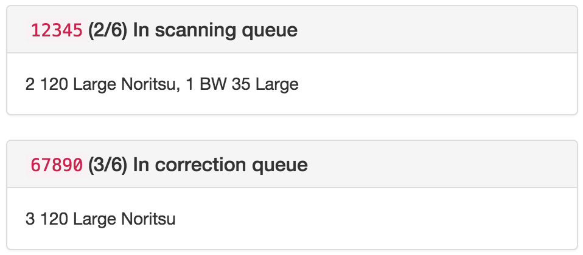

# Indie Film Status

Developing and scanning film can take a while, but that's ok. That's all part
of the fun.

Use this app to check the status of a set of film orders at
[Indie Film Lab](http://indiefilmlab.com/).

## Deploy to Heroku

First, deploy you app to Heroku:

```bash
$ heroku create yourapp
$ git push yourapp master
```

## Check order status

Once your app is deployed on Heroku, provide your email address and order numbers in the
URL:

```html
http://yourapp.herokuapp.com/#your@email.com/12345,67890
```

You'll see the status of each order:


